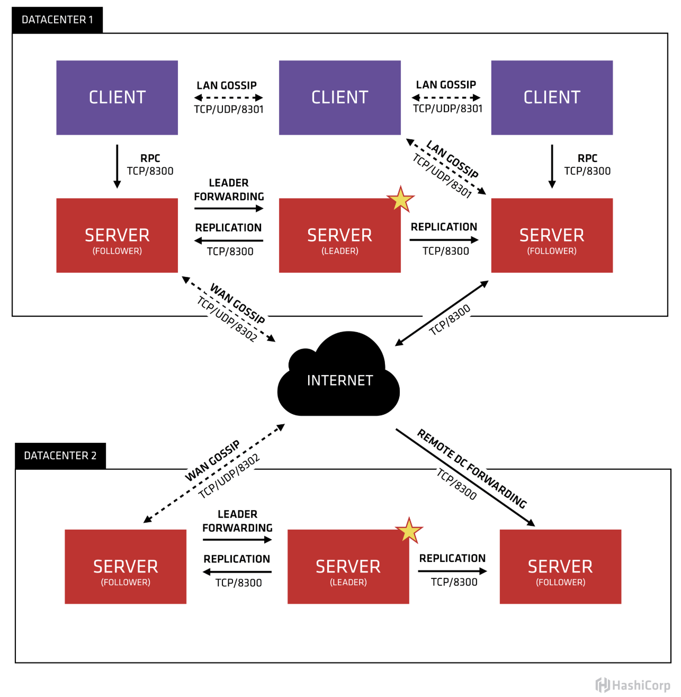
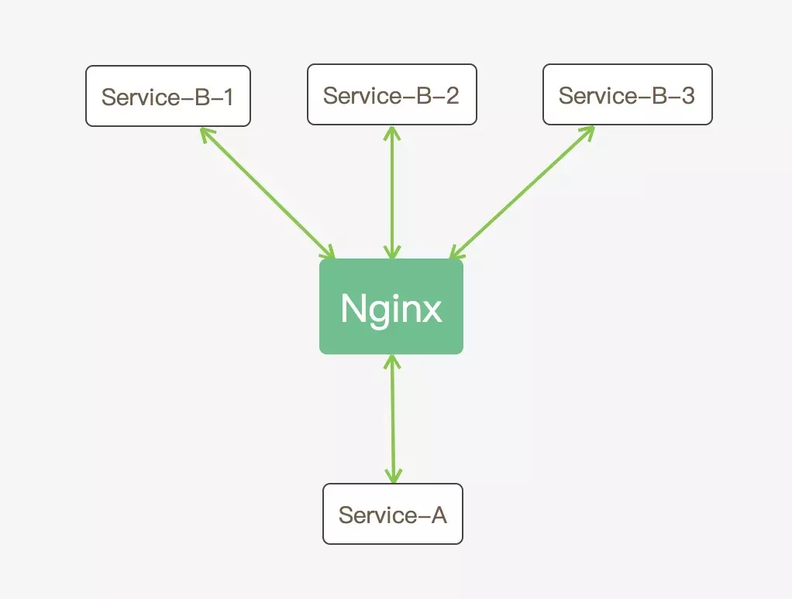
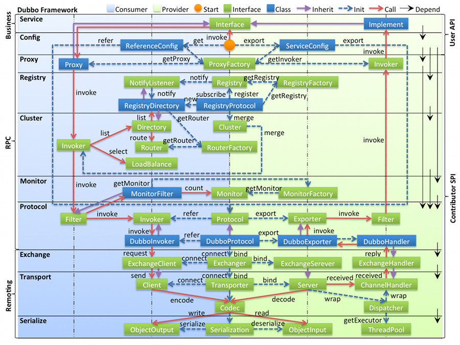
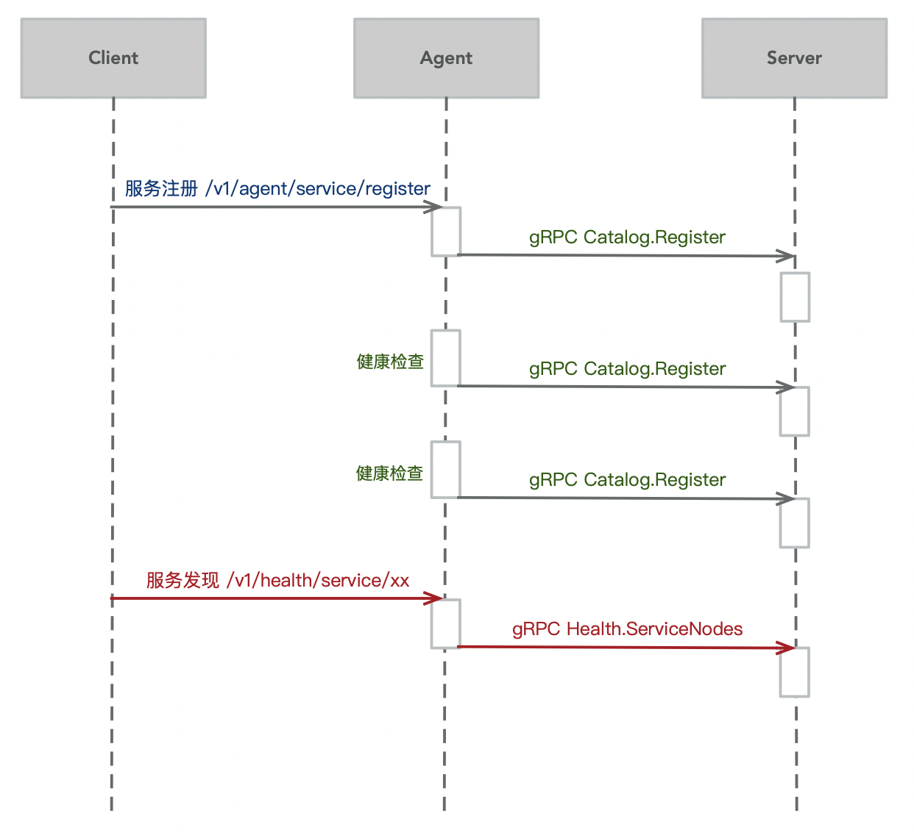
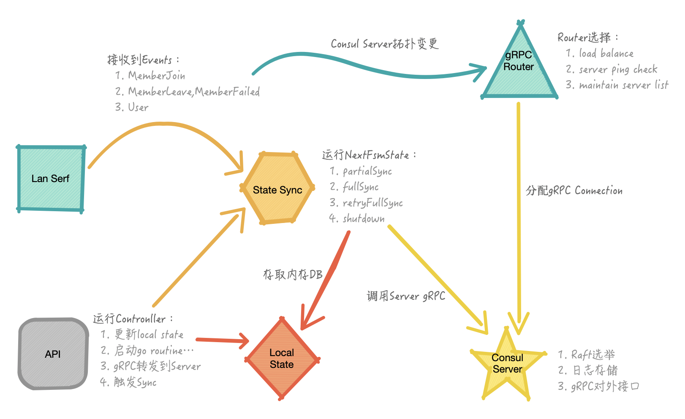

原文地址：

http://ljchen.net/2019/01/04/consul%E5%8E%9F%E7%90%86%E8%A7%A3%E6%9E%90/

https://www.hi-linux.com/posts/28048.html

https://blog.mallux.me/2017/03/19/consul/

https://blog.csdn.net/mn960mn/article/details/51768678

### 总体架构图

首先，从架构上，图片被两个datacenter分成了上下两部分；但这两部分又并不是完全隔离的，他们之间通过WAN GOSSIP在Internet上交互报文。因此，我们了解到consul是可以支持多个数据中心之间基于WAN来做同步的。WAN其实就是一个广域的网络，而LAN是一个局域网

再看单个datacenter内部，节点被划分为两种颜色，其中红色为server，紫色为client。它们之间通过GRPC通信（主要用于业务数据）。除此之外，server和client之间，还有一条LAN GOSSIP通信，这是用于当LAN内部发生了拓扑变化时，存活的节点们能够及时感知，比如server节点down掉后，client就会触发将对应server节点从可用列表中剥离出去。

当然，server与server之间，client与client之间，client与server之间，**在同一个datacenter中的所有consul agent会组成一个LAN网络**（当然它们之间也可以按照区域划分segment），当LAN网中有任何角色变动，或者有用户自定义的event产生的时候，其他节点就会感知到，并触发对应的预置操作。

**所有的server节点共同组成了一个集群，他们之间运行raft协议，通过共识仲裁选举出leader**。所有的业务数据都通过leader写入到集群中做持久化，当有半数以上的节点存储了该数据后，server集群才会返回ACK，从而保障了数据的强一致性。当然，server数量大了之后，也会影响写数据的效率。所有的follower会跟随leader的脚步，保障其有最新的数据副本。

Consul集群间使用了GOSSIP协议通信和raft一致性算法。上面这张图涉及到了很多术语：

Agent——agent是一直运行在Consul集群中每个成员上的守护进程。通过运行consul agent来启动。agent可以运行在client或者server模式。指定节点作为client或者server是非常简单的，除非有其他agent实例。所有的agent都能运行DNS或者HTTP接口，并负责运行时检查和保持服务同步。

Client——一个Client是一个转发所有RPC到server的代理。这个client是相对无状态的。client唯一执行的后台活动是加入LAN gossip池。这有一个最低的资源开销并且仅消耗少量的网络带宽。

Server——一个server是一个有一组扩展功能的代理，这些功能包括参与Raft选举，维护集群状态，响应RPC查询，与其他数据中心交互WAN gossip和转发查询给leader或者远程数据中心。

DataCenter——虽然数据中心的定义是显而易见的，但是有一些细微的细节必须考虑。例如，在EC2中，多个可用区域被认为组成一个数据中心。我们定义数据中心为一个私有的，低延迟和高带宽的一个网络环境。这不包括访问公共网络，但是对于我们而言，同一个EC2中的多个可用区域可以被认为是一个数据中心的一部分。

Consensus——一致性，使用Consensus来表明就leader选举和事务的顺序达成一致。为了以容错方式达成一致，一般有超过半数一致则可以认为整体一致。Consul使用Raft实现一致性，进行leader选举，在consul中的使用bootstrap时，可以进行自选，其他server加入进来后bootstrap就可以取消。

Gossip——Consul建立在Serf的基础之上，它提供了一个用于多播目的的完整的gossip协议。Serf提供成员关系，故障检测和事件广播。Serf是去中心化的服务发现和编制的解决方案，节点失败侦测与发现，具有容错、轻量、高可用的特点。

LAN Gossip——它包含所有位于同一个局域网或者数据中心的所有节点。

WAN Gossip——它只包含Server。这些server主要分布在不同的数据中心并且通常通过因特网或者广域网通信。

RPC——远程过程调用。这是一个允许client请求server的请求/响应机制。

在每个数据中心，client和server是混合的。一般建议有3-5台server。这是基于有故障情况下的可用性和性能之间的权衡结果，因为越多的机器加入达成共识越慢。然而，并不限制client的数量，它们可以很容易的扩展到数千或者数万台。

同一个数据中心的所有节点都必须加入gossip协议。这意味着gossip协议包含一个给定数据中心的所有节点。这服务于几个目的：第一，不需要在client上配置server地址。发现都是自动完成的。第二，检测节点故障的工作不是放在server上，而是分布式的。这是的故障检测相比心跳机制有更高的可扩展性。第三：它用来作为一个消息层来通知事件，比如leader选举发生时。

每个数据中心的server都是Raft节点集合的一部分。这意味着它们一起工作并选出一个leader，一个有额外工作的server。leader负责处理所有的查询和事务。作为一致性协议的一部分，事务也必须被复制到所有其他的节点。因为这一要求，当一个非leader得server收到一个RPC请求时，它将请求转发给集群leader。

server节点也作为WAN gossip Pool的一部分。这个Pool不同于LAN Pool，因为它是为了优化互联网更高的延迟，并且它只包含其他Consul server节点。这个Pool的目的是为了允许数据中心能够以low-touch的方式发现彼此。这使得一个新的数据中心可以很容易的加入现存的WAN gossip。因为server都运行在这个pool中，它也支持跨数据中心请求。当一个server收到来自另一个数据中心的请求时，它随即转发给正确数据中想一个server。该server再转发给本地leader。

这使得数据中心之间只有一个很低的耦合，但是由于故障检测，连接缓存和复用，跨数据中心的请求都是相对快速和可靠的。

**一个 agent 节点可以运行在 client 和 sever 模式。server 节点负责运行协商一致协议，并存储集群状态。 client 节点大多是无状态的，并且严重依赖于 server 节点。**

### 实现原理

纵观consul的实现，其核心在于两点：

- 集群内节点间信息的高效同步机制，其保障了拓扑变动以及控制信号的及时传递；

- server集群内日志存储的强一致性。

它们主要基于以下两个协议来实现：

- 使用gossip协议在集群内传播信息（gossip主要用来传播消息）

- 使用raft协议来保障日志的一致性（raft主要用来保证一致性）

### Gossip in Consul
Consul 使用 gossip 协议管理成员关系、广播消息到整个集群。 所有这些都是通过使用 Serf 库提供的。Serf 使用的 gossip 协议是基于 “SWIM：可伸缩可传导的弱一致性进程组成员资格协议”，它用来维护分布式系统中进程成员资格的协议”。

Consul 使用两个不同的 goosip pool，分别把他们称为 局域网池（LAN Pool） 或 广域网池（WAN Pool）。

每个 Consul 数据中心都有一个包含所有成员（Server 和 Client）的 LAN gossip pool。

LAN Pool 有如下几个目的：首先，成员关系允许 Client 自动发现 Server 节点，减少所需的配置量。然后，分布式故障检测允许的故障检测的工作在某几个 Server 节点执行，而不是集中整个集群所有节点上。最后，gossip 允许可靠和快速的事件广播，比如，Leader 选举。

WAN Pool 是全局唯一的，无论属于哪一个数据中心，所有 Server 应该加入到 WAN Pool。由 WAN Pool 提供成员信息让 Server 节点可执行跨数据中心的请求。集成中故障检测允许 Consul 妥善处理整个数据中心失去连接，或在远程数据中心只是单个的 Server 节点。

所有这些功能都是通过利用 Serf 提供。从用户角度来看，它是作为一个嵌入式库提供这些功能。但其被 Consul 屏蔽，用户无需关心。作为开发人员可以去了解这个库是如何利用。

### Consul的健康检查
Consul做服务发现是专业的，健康检查是其中一项必不可少的功能，其提供Script/TCP/HTTP+Interval，以及TTL等多种方式。服务的健康检查由服务注册到的Agent来处理，这个Agent既可以是Client也可以是Server。**服务是以key-value的形式存储在，由server保存并持久化，这个数据会一直存在，由agent维护哪些服务可用哪些服务不可用**

很多同学都使用ZooKeeper或者etcd做服务发现，使用Consul时发现节点挂掉后服务的状态变为不可用了，所以有同学问服务为什么不在各个节点之间同步？这个根本原因是服务发现的实现原理不同。

Consul与ZooKeeper、etcd的区别

后边这两个工具是通过键值存储来实现服务的注册与发现。

ZooKeeper利用临时节点的机制，业务服务启动时创建临时节点，节点在服务就在，节点不存在服务就不存在。
etcd利用TTL机制，业务服务启动时创建键值对，定时更新ttl，ttl过期则服务不可用。
ZooKeeper和etcd的键值存储都是强一致性的，也就是说键值对会自动同步到多个节点，只要在某个节点上存在就可以认为对应的业务服务是可用的。

Consul的数据同步也是强一致性的，服务的注册信息会在Server节点之间同步，相比ZK、etcd，服务的信息还是持久化保存的，即使服务部署不可用了，仍旧可以查询到这个服务部署。但是业务服务的可用状态是由注册到的Agent来维护的，Agent如果不能正常工作了，则无法确定服务的真实状态，并且Consul是相当稳定了，Agent挂掉的情况下大概率服务器的状态也可能是不好的，此时屏蔽掉此节点上的服务是合理的。Consul也确实是这样设计的，DNS接口会自动屏蔽挂掉节点上的服务，HTTP API也认为挂掉节点上的服务不是passing的。

鉴于Consul健康检查的这种机制，同时避免单点故障，所有的业务服务应该部署多份，并注册到不同的Consul节点。部署多份可能会给你的设计带来一些挑战，因为调用方同时访问多个服务实例可能会由于会话不共享导致状态不一致，这个有许多成熟的解决方案，可以去查询，这里不做说明。

健康检查能不能支持故障转移？

上边提到健康检查是由服务注册到的Agent来处理的，那么如果这个Agent挂掉了，会不会有别的Agent来接管健康检查呢？答案是否定的。

从问题产生的原因来看，在应用于生产环境之前，肯定需要对各种场景进行测试，没有问题才会上线，所以显而易见的问题可以屏蔽掉；如果是新版本Consul的BUG导致的，此时需要降级；如果这个BUG是偶发的，那么只需要将Consul重新拉起来就可以了，这样比较简单；如果是硬件、网络或者操作系统故障，那么节点上服务的可用性也很难保障，不需要别的Agent接管健康检查。

从实现上看，选择哪个节点是个问题，这需要实时或准实时同步各个节点的负载状态，而且由于业务服务运行状态多变，即使当时选择出了负载比较轻松的节点，无法保证某个时段任务又变得繁重，可能造成新的更大范围的崩溃。如果原来的节点还要启动起来，那么接管的健康检查是否还要撤销，如果要，需要记录服务们最初注册的节点，然后有一个监听机制来触发，如果不要，通过服务发现就会获取到很多冗余的信息，并且随着时间推移，这种数据会越来越多，系统变的无序。

从实际应用看，节点上的服务可能既要被发现，又要发现别的服务，如果节点挂掉了，仅提供被发现的功能实际上服务还是不可用的。当然发现别的服务也可以不使用本机节点，可以通过访问一个Nginx实现的若干Consul节点的负载均衡来实现，这无疑又引入了新的技术栈。

如果不是上边提到的问题，或者你可以通过一些方式解决这些问题，健康检查接管的实现也必然是比较复杂的，因为分布式系统的状态同步是比较复杂的。同时不要忘了服务部署了多份，挂掉一个不应该影响系统的快速恢复，所以没必要去做这个接管。

#### 健康检查的5种方式

https://blog.51cto.com/4436396/2053227

Consul支持五种健康检测的方式，分别为：Script+Interval、Http+Interval、TCP + Interval 、Time to Live (TTL)、Docker+ interval。接下来对每种方式进行详细介绍。

Script+Interval：这种方式中，通过执行外部脚本来进行健康检测。脚本按照指定时间来进行循环调用（比如30S调用一次）。脚本默认超时时间是30S，可以通过timeout来指定。

Http+Interval：这种检查将按照预设的时间间隔创建一个HTTP GET请求。HTTP响应代码来标识服务所处状态：任何2xx代码视为正常，429表示警告——有很多请求；其他值表示失败。Http默认的超时时间为Interval中指定的时间，最大时间为10秒。

TCP + Interval：将按照预设的时间间隔与指定的IP/Hostname和端口创建一个TCP连接。服务的状态依赖于TCP连接是否成功——如果连接成功，则状态是“success”；否则状态是“critical”。如果一个Hostname解析为一个IPv4和一个IPv6，将尝试连接这两个地址，第一次连接成功则服务状态是“success”。
如果希望通过这种方式利用外部脚本执行健康检查，那么脚本应该采用“netcat”或者简单的socket操作。
默认情况下，TCP checks中，请求超时时间等于调用请求的间隔时间，最大10秒。也是可以自由配置的。

Time to Live (TTL)：这种checks为给定TTL保留了最后一种状态，checks的状态必须通过HTTP接口周期性更新，如果外部接口没有更新状态，那么状态就会被认定为不正常。这种机制，在概念上类似“死人开关”，需要服务周期性汇报健康状态。比如，一个健康的APP可以周期性的将状态put到HTTP端；如果app出问题了，那么TTL将过期，健康检查将进入Critical状态。用来为给定check更新健康信息的endpoint都是pass endpoint和fail endpoint。（参见agent http endpoint）TTL checks同时会将其最后已知状态更新至磁盘，这允许Agent通过重启后恢复到已知的状态。通过TTL端上一次check来维持健康状态的有效性。

Docker+ interval：这种检查依赖于调用封装在docker容器内的外部程序。运行的docker通过docker Exec API来触发外部应用。我们期望，consul Agent用户访问Docker HTTP API或UNIX套接字。Consul使用$DOCKER_HOST来确定DockerAPI端点。应用程序将运行，并对在容器内运行的服务执行健康检查，并返回适当的退出代码。Check按照指定的时间间隔调用。如果在同一个host主机上有多重shell，那么同样需要配置shell参数。输出限制在4K以内，输出大于4K将截断。

### 为什么需要注册中心

https://juejin.im/post/5ca1f1acf265da308d50be02

假设在分布式系统中有两个服务 Service-A （下文以“S-A”代称）和 Service-B（下文以“S-B”代称），当 S-A 想调用 S-B 时，我们首先想到的时直接在 S-A 中请求 S-B 所在服务器的 IP 地址和监听的端口，这在服务规模很小的情况下是没有任何问题的，但是在服务规模很大每个服务不止部署一个实例的情况下是存在一些问题的，比如 S-B 部署了三个实例 S-B-1、S-B-2 和 S-B-3，这时候 S-A 想调用 S-B 该请求哪一个服务实例的 IP 呢？还是将3个服务实例的 IP 都写在 S-A 的代码里，每次调用 S-B 时选择其中一个 IP？这样做显得很不灵活，这时我们想到了 Nginx 刚好就能很好的解决这个问题，引入 Nginx 后现在的架构变成了如下图这样：

引入 Nginx 后就解决了 S-B 部署多个实例的问题，还做了 S-B 实例间的负载均衡。但现在的架构又面临了新的问题，分布式系统往往要保证高可用以及能做到动态伸缩，在引入 Nginx 的架构中，假如当 S-B-1 服务实例不可用时，Nginx 仍然会向 S-B-1 分配请求，这样服务就不可用，我们想要的是 S-B-1 挂掉后 Nginx 就不再向其分配请求，以及当我们新部署了 S-B-4 和 S-B-5 后，Nginx 也能将请求分配到 S-B-4 和 S-B-5，Nginx 要做到这样就要在每次有服务实例变动时去更新配置文件再重启 Nginx。这样看似乎用了 Nginx 也很不舒服以及还需要人工去观察哪些服务有没有挂掉，Nginx 要是有对服务的健康检查以及能够动态变更服务配置就是我们想要的工具，这就是服务注册与服务发现工具的用处。下面是引入服务注册与服务发现工具后的架构图：

在这个架构中：

首先 S-B 的实例启动后将自身的服务信息（主要是服务所在的 IP 地址和端口号）注册到注册工具中。不同注册工具服务的注册方式各不相同，后文会讲 Consul 的具体注册方式。
服务将服务信息注册到注册工具后，注册工具就可以对服务做健康检查，以此来确定哪些服务实例可用哪些不可用。
S-A 启动后就可以通过服务注册和服务发现工具获取到所有健康的 S-B 实例的 IP 和端口，并将这些信息放入自己的内存中，S-A 就可用通过这些信息来调用 S-B。
S-A 可以通过监听（Watch）注册工具来更新存入内存中的 S-B 的服务信息。比如 S-B-1 挂了，健康检查机制就会将其标为不可用，这样的信息变动就被 S-A 监听到了，S-A 就更新自己内存中 S-B-1 的服务信息。

在这个架构中：

首先 S-B 的实例启动后将自身的服务信息（主要是服务所在的 IP 地址和端口号）注册到注册工具中。不同注册工具服务的注册方式各不相同，后文会讲 Consul 的具体注册方式。

服务将服务信息注册到注册工具后，注册工具就可以对服务做健康检查，以此来确定哪些服务实例可用哪些不可用。

S-A 启动后就可以通过服务注册和服务发现工具获取到所有健康的 S-B 实例的 IP 和端口，并将这些信息放入自己的内存中，S-A 就可用通过这些信息来调用 S-B。

S-A 可以通过监听（Watch）注册工具来更新存入内存中的 S-B 的服务信息。比如 S-B-1 挂了，健康检查机制就会将其标为不可用，这样的信息变动就被 S-A 监听到了，S-A 就更新自己内存中 S-B-1 的服务信息。

### 服务发现与注册

1、注册服务：服务提供者到注册中心注册；

2、订阅服务：服务消费者到注册中心订阅服务信息，对其进行监听；

3、缓存服务列表：本地缓存服务列表，减少与注册中心的网络通信；

4、调用服务：先查找本地缓存，找不到再去注册中心拉取服务地址，然后发送服务请求；

5、变更通知：服务节点变动时 (新增、删除等)，注册中心将通知监听节点，更新服务信息。

对于第三方的服务注册与发现的实现，现有的工具主要有以下三种：

- zookeeper：一个高性能、分布式应用程序协调服务，用于名称服务、分布式锁定、共享资源同步和分布式配置管理。
- Etcd：一个采用HTTP协议的健/值对存储系统，主要用于共享配置和服务发现，提供的功能相对Zookeeper和Consul相对简单。
- Consul：一个分布式高可用的服务发现和配置共享的软件，支持服务发现与注册、多数据中心、健康检查和分布式键/值存储。

与Zookeeper和etcd不一样，Consul内嵌实现了服务发现系统，不需要构建自己的系统或使用第三方系统，客户只需要注册服务，并通过DNS或HTTP接口执行服务发现。

### 服务注册发现流程

通过上图，我们大概知道了在consul agent中，功能分为了consul server和consul agent（client）。在前面架构介绍中我们已经阐述了server和client各自的职责。

consul源码中，server和client都是在一套代码中，通过指定启动参数的形势来运行consul server。这里我们先来重点讲解一下consul client的内部架构。

Consul Client架构

lan serf:主要职责是维护节点之间的关系，当有节点加入或者离开的时候，所有节点都会接收到对应的event，这里的lan serf就是指对这些event做处理的handler的go routine服务。

state sync:在consul启动的时候，会启动该服务，它监听一个channel，当其他服务有向consul server同步配置的需求的时候，就会像channel中写入event信息；然后就会触发该服务向consul server同步配置信息。这里的同步又分为全同步和部分同步，主要是为了降低网路的负担。

gRPC router:这是对连接到consul server的gRPC连接的维护和负载均衡机制。在该服务中心，一方面会基于lan serf对consul server节点的拓扑变更事件来维护server列表，另一方面也会对到存活server的connection做定期的ping来维护连接列表；除此之外，还能够对server连接做客户端负载均衡。

local state:是一个本地的内存数据库，一般执行sync就是从server将数据同步过来保存到该db中；平时做一些配置更改也会对应更新该db。

api:consul是提供了HTTP和CLI两种对外访问方式的，这里所谓的API并不是想说接口的细节，而指的是consul所提供对外API对应controller逻辑实现。比如下一节要讲到的服务注册的API，后面都做了什么业务逻辑，这是很重要的一部分，对于复杂的逻辑一般包括了：更新本地local state，启动对应的go routine来做事，使用gRPC向server更新数据，向sync channel发消息从而触发sync等操作。

首先(就是agent)s.agent.AddService函数要做的就是将接收到的服务信息做一通校验，然后整理成为local state的数据结构之后保存到本地；但是由于它是一个内存数据库，并不能够持久化，于是再将其保存到本地文件中做持久化。

干完这些操作之后，如果该服务没有指定healthcheck操作的话，接下来要做的就是将这个服务注册请求同步到consul server，让raft leader将数据真正持久化到server中，这部分我没有在图上体现出来，但是在代码中确实是这样实现的。

对于在注册的时候制定了healthcheck内容的服务，需要继续注册healthcheck。由于consul支持的healthcheck类型较多，这里对其所指定类型做了简单的校验，然后就开始干正事了。启动一个goroutine来专门为这个服务执行定期的健康检查操作，可见，如果该consul agent上注册的服务太多的话，势必消耗很多资源，这就要求我们部署方案要做好规划了。

当健康检查的结果与先前的结果不一致的时候，会触发对local state的更新，同时，需要局部同步该服务到consul server上的内容。为什么呢？因为服务的健康状态其实是保存到其check字段下的，而非是service的一个一级属性，这块大家可以下去查阅一下代码。另外，每次状态变更都会触发consul agent通过gRPC调用server的Catalog.Register来注册服务，我的理解其实是覆盖先前注册关于该服务的信息。

