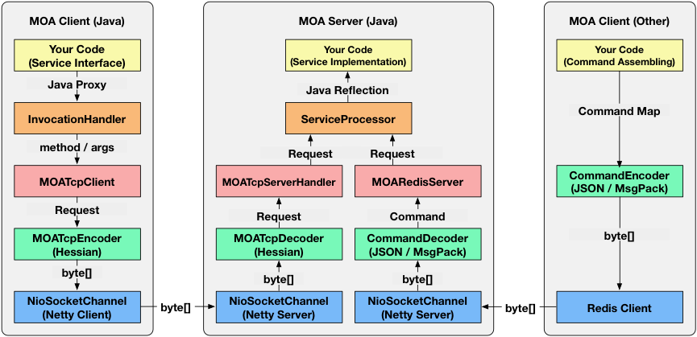
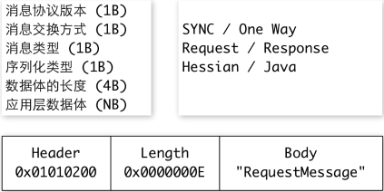
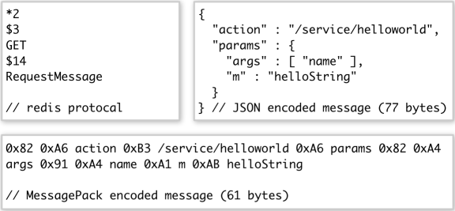
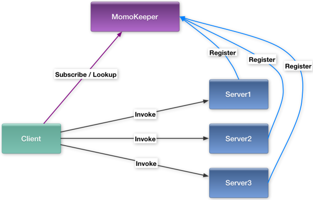
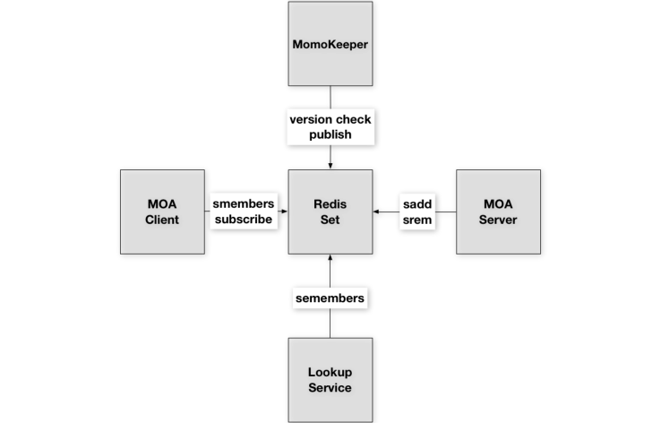

### 介绍

1.远程调用

在约定的接口之上，将一次请求交给远程的server处理，并获取响应。只要接口不做修改，server端的任何逻辑变更都不需要client做出改动，从而实现了系统间的解耦。

2.服务发现

当进行远程通信时，仅有一个server会让系统变得不可靠，因此通常server会启动多个实例。client通过某种策略分配请求实现负载均衡，当有server故障时将请求切换到其他实例实现高可用。client需要服务发现机制来感知server集群状态的变化。

### 基础架构
MOA框架由Java编写，支持Java语言发布服务、跨语言消费服务。client向server发起远程调用的流程如下图所示

### Java Client调用
通过接口的Proxy对象发起调用
在InvocationHandler中获取调用方法名、参数信息
在MOATcpClient中封装成Request对象
在MOATcpEncoder中序列化成byte字节流
通过Netty Client将字节数据发送给远程Server
Java Server处理请求
通过Netty Server接收字节数据
在MOATcpDecoder反序列化成Request对象
在MOATcpServerHandler中选取接口对应的Processor
在ServiceProcessor中通过Java反射调用接口实现方法
执行实际的业务逻辑代码
跨语言调用
构建包含接口、方法、参数信息的Command请求
将Command通过Json或MsgPack序列化成字节流
通过Redis Client将字节数据发送给远程Server
对于跨语言请求，除了将字节数据反序列化成Request对象时，需要采用跨语言协议中的Json或MsgPack方式外，后续的处理流程与Java请求完全相同。

### 通信协议
client与server间的通信包含两个层面的协议

1.封包/拆包协议:TCP通信时分隔数据包的协议

- Java采用一种Header + Length + Body形式的私有协议
- 跨语言请求采用Redis协议，通过GET命令的key字段传递请求数据

2.序列化协议:Request / Response对象与字节数据相互转换的协议

- Java采用Hessian序列化
- 跨语言采用Json / MsgPack序列化

Java协议示例

跨语言协议示例

服务发现

- 当server启动时，会将自己的地址写入到服务注册中心（MOA框架中为MomoKeeper）
- client消费服务时，通过注册中心查找某个服务server地址列表
- client与server建立TCP连接，发送请求、接收响应
- client从注册中心获取地址有两种模式

Subscribe:对于Java Client，JVM内存中会保存一份server地址列表的镜像，通过变更订阅的方式进行更新。

Lookup:对于跨语言的Client，通常采用一种轮询+缓存的方式，每隔一段时间过期缓存中的数据，再从注册中心获取地址重新写入缓存。

MOA中服务注册中心采用基于Redis的实现方式，以服务名serviceUri为key的Set作为主要存储结构，集合中的每一个元素为server的hostport。服务注册、注销、查询都是通过对应的集合操作命令来实现。此外MomoKeeper还会单独起一个进程进行Version Check和Alive Check的工作。对于上述每一个集合计算hashcode作为版本值，当检测到集合中的元素发生变化时，通过Redis publish / subscribe的方式通知Java Client。同时对每一个server的hostport进行ping检测，将无法连接的server从地址列表里移除。

小结
本文介绍了MOA框架的主要功能和基本原理，同时也是设计一个服务框架的基本思路。通过自主研发可以实现很多定制化的需求，但同时也有很多问题需要完善。欢迎大家提出宝贵的建议。

